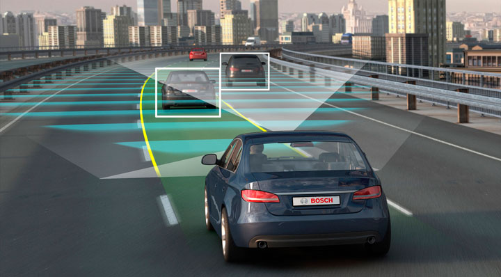
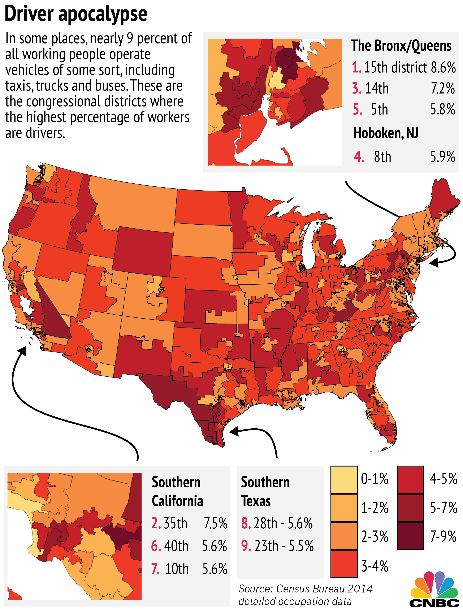

# Driverless Cars

### by Lukas Herman

---

# Topics

- Impacts on society
- Ethical issues

---

# Impacts on Society

---

## Driving Job Loss

> "When autonomous vehicle saturation peaks, U.S. drivers could see job losses at a rate of 25,000 a month, or 300,000 a year."

by [Goldman Sachs Economics Research](https://www.cnbc.com/2017/05/22/goldman-sachs-analysis-of-autonomous-vehicle-job-loss.html)

---

