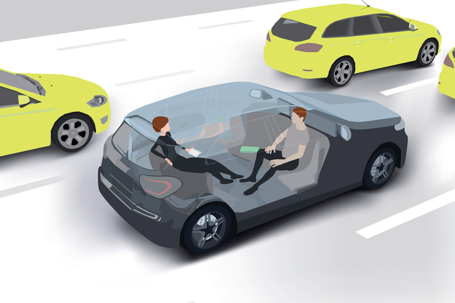
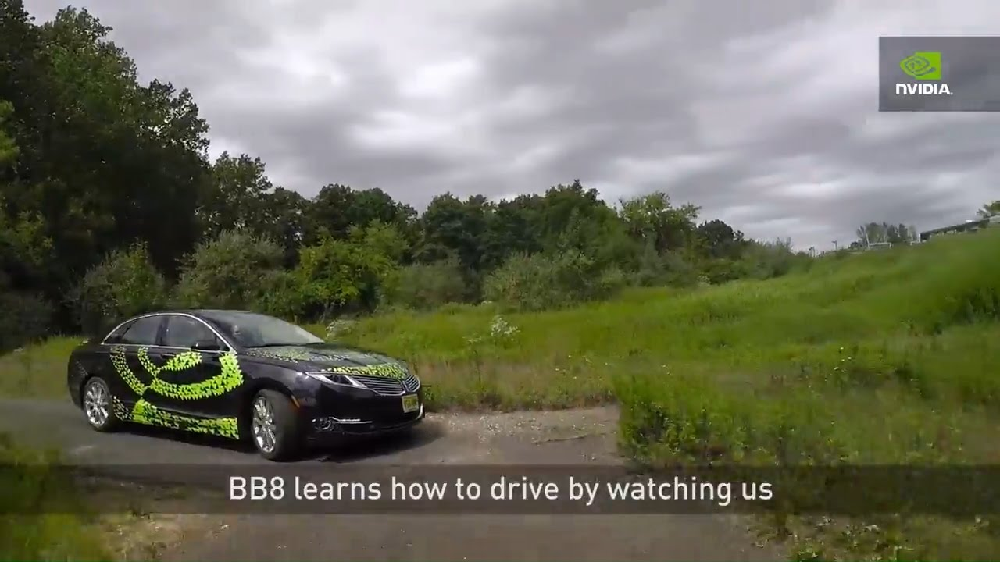

# Driverless Cars

### by Lukas Herman

---

# Topics

- Impacts on society
- Ethical issues

---

# Impacts on Society

---

## Driving Job Loss

> "When autonomous vehicle saturation peaks, U.S. drivers could see job losses at a rate of 25,000 a month."

by [Goldman Sachs Economics Research](https://www.cnbc.com/2017/05/22/goldman-sachs-analysis-of-autonomous-vehicle-job-loss.html)

---

---

### And more job losses in other industries

- Parking
- Hotel
- Real Estate
- Law Enforcement
- Insurance
- ...

by [CNBC](https://www.cnbc.com/2017/05/03/self-driving-cars-will-disrupt-10-industries-commentary.html)

---

# Ethical Issues

---

## Trolley Problem

> Would you sacrifice an old couple or a child?

---

## Technology will never be perfect

> Our world is too complex. We'll never reach 100% accuracy.

---

## Conversation with an Nvidia engineer

---

## Black Box Problem

---

> Can you trust your car if there is a definite possibility to kill you?

---

<i class="fa fa-github fa-5x" aria-hidden="true"></i>

   <small> github.com/lherman-cs/presentations/tree/cpsc2910</small>

