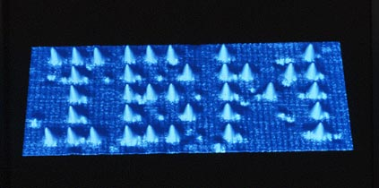
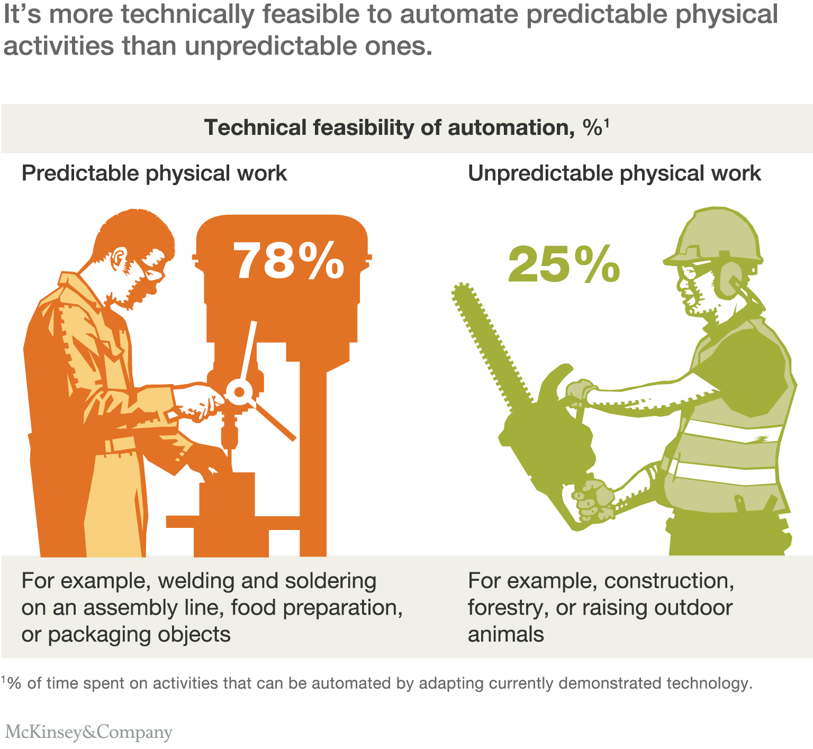

# RFID, Nanotech, and AI

### by Gabrielle Stewart

---

# RFID

---

### History 
- since 1970
- too expensive for large scale until recently
- tracked:
    -  cows
    -  railroad cars 
    -  airline luggage

---

---

### Technology

 - often 2 kilobytes of data 
 - composed of 
     - microchip
     - antenna
     - battery (sometimes)

---

### accessible and popularized
 - toll passcards
 - subway passes

---

### less expensive to produce
 - Passive
     - 20 ft
     - 7 - 10 cents
     - objective = 5 cents

---

### Department of State & Department of Homeland Security (DHS)
 - issuing electronic passports
 - digital signature 
 - photograph
 - biometric identifier

---
## Hackers
- have proven that some RFID tags can be tampered with, including disabling their anti-theft features and changing the price that corresponds to their product
---
### Skimming: 
when someone uses an RFID reader to scan data from an RFID chip without the e-passport holder's knowledge.

---
### NFC chips
 -  tapped against instead of swiped fix skimming problem

---

### Eavesdropping: 
 - when someone reads the frequencies emitted from the RFID chip as it is scanned by an official reader.

---

### Animal chipping for pets 

### Human chipping
- emergency contact information and medical histories
    - Alzheimer's

---
### Babies 
   - kidnapping
   - SIDS
--- 
### "The [store] shelves themselves will communicate wirelessly with the network"
 
 
---
### Will human chipping become mandatory? 

### Would you entrust your medical history to an RFID tag?

### How about your home address or your baby's safety? 

---

# Nanotechnology

- 1/1,000,000,000 of a meter
---
### 1,600-year-old Roman chalice

### 1989

---
### Microprocessors Weaponry Medicine

---
### Quantum Mechanics
- teleportation and electron tunneling

---
### Blood Brain Barrier
- toxic

---
### Buckypaper
-  10 times lighter
-  500 times stronger

---
### Rapid healing to night vision
- Two races of people
### World's economy?
- Manufacturing

---
### Unessisary? Premature?

---
# AI

---
### Patterns

---
### 500 hours Lip Read
### Tumor Outcome
---
### Eugene Goostman

---

---
- immediately obserbable characteristics
- lack abstract model

---

---

---
## Labor
> 3.5 million truck drivers
> lower risk of accidents

---
### We base compensation on contribution to the economy

---
### 5% 
- more complex roles
- pre-industrialized world

---
### Wage Gap
- Detroit vs Silicone Valley
    - same money made
    - 10x less workers 
---
### Genocide?

---

---
### Singularity
> the point in time when human beings are no longer the most intelligent beings on earth

---
### Technological progress => better lives for everyone

---
### Unquestionably Technology has vast potential, and it's responsible implementation is up to us

---
## Works Cited
https://science.howstuffworks.com/nanotechnology6.htm
https://electronics.howstuffworks.com/gadgets/high-tech-gadgets/rfid.htm
https://www.weforum.org/agenda/2016/10/top-10-ethical-issues-in-artificial-intelligence/
https://www.youtube.com/watch?v=IJKjMIU55pE
http://www.trucking.org/News_and_Information_Reports_Industry_Data.aspx

---

<i class="fa fa-github fa-5x" aria-hidden="true"></i>

   <small> github.com/gestewa/presentations/tree/cpsc2910</small>

